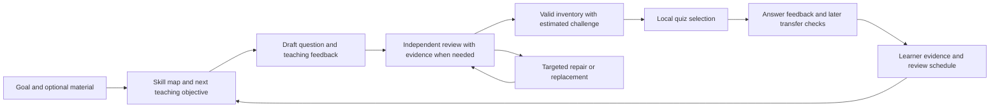

# General learning hardening plan

Research and code review: September 2026. This is a proposal, not an implemented feature or a deployment. It builds on [the recorded live failures](LEARNING_VALIDATION.md) and the [adaptive learning contract](ADAPTIVE_LEARNING.md).

The recommended next milestone is an instrumented comparison of the current pipeline with a simpler, reasoning-enabled baseline. Then address the content constraints and review decisions that the comparison shows are harmful. Keep one system for arbitrary learning goals. Source material can be supplied or retrieved when needed; a new subject must not require a hand-built curriculum or a production branch.

## What the current evidence establishes

| Observation in Checkpoint | Implication and uncertainty |
| --- | --- |
| The generator explicitly disables Kimi K2.5 thinking. The Claude reviewer has no explicit reasoning configuration. | Compare reasoning settings and model capability before expanding prompts further. This is a configuration fact, not proof that enabling thinking solves the failures. See `question_generation.py`, `_additional_model_request_fields`. |
| The author is instructed to stay under 280 characters; the backend rejects prompts over 320; the client clips at 360. Choices are bounded at 140. | Necessary premises, excerpts, and constraints compete with severe text limits. A richer item format may improve answerability. Measure this rather than assuming every long question is better. |
| Both sanitization and review reject an item when its difficulty differs from an exact per-skill integer. | Correctness and challenge calibration are coupled. A valid level-3 item can be discarded while trying to replenish level 4. Existing logs do not establish how often this caused the missing slots. |
| Many different rejection paths return an empty list without a reason. A malformed review envelope can discard an entire batch. | We cannot yet distinguish bad reasoning, length, difficulty mismatch, duplicate detection, malformed output, and budget exhaustion reliably. Instrumentation comes first. |
| The prompt rejects questions testing the same fact or mechanism while also requesting fresh practice of missed concepts. | Novelty rules can conflict with purposeful retrieval practice. Test novelty of the application separately from repetition of the learning objective. |
| Nine known-error/valid controls produced five passes; four known-invalid items were accepted. Mixed-level live banks often filled only 2–3 of 5 slots. | Model agreement and a populated bank are inadequate acceptance measures. These small, selected samples do not estimate an overall production error rate. |
| Adaptation uses recent first answers, integer levels, and a 30-day evidence window. Existing scheduling already supports due reviews and maintenance. | Preserve this useful foundation. Add uncertainty and concept-level retention; do not claim that a new learner model has already been validated. |

Code touchpoints: [generation](../backend/bedrock-question-service/question_generation.py), [sanitization](../backend/bedrock-question-service/question_quality.py), [review](../backend/bedrock-question-service/question_verification.py), [adaptive policy](../Checkpoint/App/AdaptiveLearningPolicy.swift), [selection](../Checkpoint/App/CheckpointQuestionSelector.swift), [client sanitizer](../Checkpoint/Services/QuestionBatchSanitizer.swift).

## Research that changes the plan

These sources motivate experiments. They do not establish that a particular configuration will work across all Checkpoint goals.

| Primary source | Finding and application |
| --- | --- |
| [Huang et al., ICLR 2024: intrinsic self-correction](https://proceedings.iclr.cc/paper_files/paper/2024/hash/8b4add8b0aa8749d80a34ca5d941c355-Abstract-Conference.html) | Tested models struggled to correct reasoning without external feedback and sometimes became worse. Do not equate another request to reconsider with independent validation. This concerns the studied models and tasks, not a universal claim about all newer models. |
| [Gou et al., ICLR 2024: CRITIC](https://arxiv.org/abs/2305.11738) | Tool feedback improved results on the evaluated question-answering, mathematical program-synthesis, and toxicity tasks. Test general retrieval and computation tools for question verification. The paper does not prove correctness of AI-generated quizzes. |
| [Feng et al., 2025: MCQ difficulty prediction](https://arxiv.org/abs/2503.08551) | Their difficulty model uses reasoning, distractor behavior, and actual student-response data; evaluation covers two math datasets. Treat an LLM's difficulty rating as an initial estimate. Recalibrate using learner evidence, and do not equate cognitive complexity with measured human difficulty. |
| [Leite and Lopes Cardoso, BEA 2025: controlled question generation](https://aclanthology.org/2025.bea-1.46/) | Joint narrative and difficulty control showed preliminary, inconsistent success in reading comprehension. Request concrete reasoning demands, then evaluate whether the question actually satisfies them. A difficulty label alone is insufficient. |
| [NBME item-writing guide](https://www.nbme.org/sites/default/files/2021-02/NBME_Item%20Writing%20Guide_R_6.pdf) | A focused question should be answerable before inspecting its options, with clear wording and comparable choices. Apply these general construction principles; its health-science examples are not a proposed subject restriction. |
| [Corbett and Anderson, 1994: knowledge tracing](https://link.springer.com/article/10.1007/BF01099821) | A programming tutor tracked estimated knowledge of individual rules to sequence exercises. This supports a persistent learner model separate from generated prose; arbitrary AI-inferred skills still need validation. |
| [Settles and Meeder, ACL 2016: trainable spaced repetition](https://aclanthology.org/P16-1174/) | A memory model fitted to language-learning interactions improved recall prediction and engagement in that setting. Use time since practice and response history when scheduling. General reasoning skills may require a different fitted model. |
| [Butler and Roediger, 2008: MCQ feedback](https://link.springer.com/article/10.3758/MC.36.3.604) | Immediate and delayed feedback improved later recall and reduced reproduction of incorrect alternatives compared with no feedback. Corrective teaching is part of the learning mechanism, and explanations need their own quality checks. |
| [Anthropic, January 2026: evaluation practice](https://www.anthropic.com/engineering/demystifying-evals-for-ai-agents) | Practical guidance recommends complementary code, model, and human grading, repeated trials, and separate capability and regression suites. Use this as engineering guidance, not an independent efficacy study. |

## Proposed shared pipeline

The repair loop has a strict limit. These are responsibilities, not a requirement to make a separate model call for every box. Reuse the existing asynchronous bank and local quiz path.

### 1. Establish a capable baseline and explain every rejection

Record a candidate ID, model/configuration and prompt versions, requested objective, raw lengths, parse outcome, stop reason, review disposition, assessed challenge, elapsed time, provider calls, and token usage. Use explicit reasons such as `missing_premise`, `answer_disagreement`, `multiple_defensible_choices`, `difficulty_mismatch`, `length_limit`, `duplicate_application`, and `budget_exhausted`. Save bounded diagnostic content only in appropriate development storage; learner source documents and answers must not become routine public logs.

Run the same inputs through the current setup and reasoning-enabled alternatives. Change the author first while holding the reviewer fixed; then compare reviewer settings on a frozen candidate set. Also compare a concise authoring prompt against the current large prompt. This distinguishes model capability from orchestration problems.

The provider adapter needs explicit capability handling. [AWS documents reasoning support and sampling restrictions](https://docs.aws.amazon.com/bedrock/latest/userguide/claude-messages-extended-thinking.html); the current temperature configuration cannot simply be retained for every thinking mode. Confirm the exact model, endpoint, token budget, and response handling with a small capability probe before the larger evaluation. Keep reasoning budgets bounded and count total cost per usable item.

Use schema-constrained output where the chosen model and endpoint support it. [Bedrock's documentation](https://docs.aws.amazon.com/bedrock/latest/userguide/structured-output.html) describes Converse support, schema limitations, initial compilation latency, and incompatibility with Anthropic's native citations feature. Preserve application checks for four choices, bounds, IDs, and semantic correctness. A schema fixes formatting, not false answers. Evidence references can use application-owned source IDs with server-checked excerpts; they must not be invented citation strings.

### 2. Give each question enough context and an explicit teaching purpose

Introduce a versioned item contract with a short lead-in, optional context/passage/code, stable choice IDs, a keyed correct-choice ID, an objective ID, an intended reasoning operation, and answer feedback. Separate the logical answer identity from shuffled labels and mutable display text.

Prototype larger limits—for example, up to 1,200 characters of context and 240 per choice—while measuring mobile reading time and clarity. These are starting values, not research-derived optima. Prefer concise items, but reject or repair overlong content rather than silently clipping a premise or answer. Test display, accessibility, persistence, history snapshots, cache transport, and legacy decoding together. Update all limits and coverage fingerprints coherently. A new schema must not accidentally fail the existing `verificationVersion == 1` rollout and grading checks.

The planner should specify what makes this item useful: applying a rule, comparing alternatives, diagnosing an error, combining two known concepts, or transferring to an unfamiliar setting. It should say what support is available and which misconception the distractors probe. A longer question or obscure vocabulary does not automatically make it a better challenge.

Permit fresh applications of the same objective. Keep exact repeats and superficial rewrites out of new-learning inventory, while giving deliberate review a distinct purpose and evidence weight. Test generated content against the requested operation, not only its topic label.

### 3. Separate correctness, repair, and placement

Use distinct outcomes: usable at the requested challenge; usable at another estimated challenge; repairable; or unusable. Never relax the single-defensible-answer requirement to fill inventory.

Retain useful, correct questions at their assessed challenge. They must not fill the missing harder-slot quota or count as evidence of advanced mastery. Keep an explicit limit on easier fallback items so the system cannot quietly stagnate. Respect the user's difficulty floor and preserve existing app-blocking and break rules during the initial experiment.

Have the author establish a self-contained problem and supported answer before constructing plausible alternatives. Keep the reviewer blind to the author's key and justification. Review the final teaching explanation too: the recent photography error was in the explanation as well as the question's assumptions. An optional experiment can have a reviewer solve the stem before seeing the choices; retain that extra call only if it measurably reduces anchoring errors.

Use external evidence where it can resolve uncertainty. Factual claims can be checked against authoritative material; calculations and executable examples can use bounded computation. These capabilities are selected from the question's needs, not an exam-name switch. Supplied fictional rules are valid evidence for an invented subject. Retrieved text remains untrusted, and a successful calculation does not establish that the model translated the original premises correctly. Generic tooling is compatible with a generalized product; bespoke exam filters are unnecessary.

Allow one targeted repair using the recorded reason, followed by fresh review. Ambiguous or unsupported items can be replaced with a different question on the same objective. Preserve independently valid candidates when another item fails. Do not automatically change an answer key merely because a reviewer disagrees, or repeat the same generation attempt until a model happens to approve it.

### 4. Make adaptation about understanding and retention

Keep the current first-answer exclusion, reported-item handling, per-skill planning, feedback, and due-review behavior. Extend evidence to stable learning objectives: recent independent answers, delayed retrieval, observed difficulty, uncertainty, and suspected misconceptions. A single distractor choice is a hypothesis about a misconception, not a diagnosis.

Test an interpretable knowledge model, such as a conservative knowledge-tracing baseline, alongside the current policy. Use cautious initial assumptions until there is enough real response data to fit parameters. Do not add a deep learning model solely because it is more complex. Compare calibration and next-question choices, then test learning outcomes.

Maintain a separate concept-level review schedule so retiring an exact question does not retire the knowledge. Decay confidence gradually with time and use delayed probes instead of abruptly equating the absence of recent answers with lack of knowledge. Preserve prerequisite history when the AI proposes deeper successor skills.

A quiz should combine useful current practice, due review, and bounded stretch. Improving learners should reach new applications and successor objectives while still revisiting older knowledge. After a mistake, give a short explanation or worked example, then check the concept later in a different setting. Use delayed, unseen questions to distinguish retention from memorizing feedback.

Keep the current default five-question/four-correct break policy for initial technical comparisons. A separate product pilot should check whether increasing challenge makes breaks feel unfair or causes repeated failures. Any change to how breaks are earned is a product decision, not an incidental side effect of the learning algorithm.

## Experiment and implementation order

| Milestone | Concrete deliverable | Evidence required to proceed |
| --- | --- | --- |
| A. Diagnose | Candidate traces and a replayable report across existing failures and valid controls. | Every discarded candidate has a reason; attempted, accepted, repaired, and served counts reconcile. Human/reference review checks a sample of both acceptances and rejections. |
| B. Model and prompt comparison | Compare the current setup with reasoning-enabled authoring, then reviewer variants on frozen drafts. Include a simple prompt baseline. | Fewer materially incorrect accepted items at an acceptable cost per usable question. Report coverage and false rejections separately. Model agreement is not the scoring reference. |
| C. Item and review contract | Richer context, stable choice IDs, separate correctness/placement, bounded repair, deliberate review variants. | No text loss or grading changes through server-to-device round trips; higher-level coverage improves without disguising easier questions or accepting more errors. |
| D. Learner progression | Objective-level evidence, confidence and review scheduling, plus evaluated successor-skill planning. | Scripted improving, struggling, guessing, returning, and mixed-strength learners receive appropriate tasks; repeated revealed answers never demonstrate new mastery. |
| E. Pilot | Frozen generation configuration, monitored reserves, feedback and delayed transfer checks with learners. | Assess learning, frustration, completion and reliability together. Retention claims require learner evidence, not simulated students or more filled banks. |

For the first comparison, freeze a small development matrix of six unrelated goals, three learner profiles, and two runs per profile, generating five candidates per request: 180 candidates per configuration. Include raw titles, focused goals, supplied material, an unfamiliar fictional subject, and strong/weak skills within one goal. Select examples from the existing broad fixtures; these are test cases, never product categories. Keep additional goals completely out of prompt tuning for the final comparison.

Run all ten recorded correctness fixtures plus valid controls through each reviewer configuration. They are a stress suite, not a representative sample. Separately inspect a stratified sample of new accepted and rejected questions, blind to the generating configuration, using references or computation and human adjudication where needed. Audit answer correctness, missing assumptions, explanation correctness, distractor quality, objective alignment, and genuine transfer. Record uncertainty and disagreements. An AI-written gold key or simulated learner must not be treated as human ground truth.

Report correct usable questions per provider call and per dollar, false acceptance, false rejection, coverage by requested operation and level, completion rate for a five-item reserve, and cold/warm preparation latency. A more expensive call can be cheaper overall if it avoids repeated failed batches. Choose numerical service and quality targets from the baseline and product budget before selecting a winner; do not invent an achieved reliability percentage from the small existing sample.

Before release, require the known defects to remain caught, an independently audited held-out sample with no known unresolved material errors, successful graded-item transport and rollout checks, and functioning inventory fallback. These are release decisions, not proof of universal correctness. In the pilot, measure delayed performance on new applications of practiced concepts, alongside time spent, frustration, break completion, and app-blocking reliability. A subsequent efficacy trial should determine sample size from observed variance and the improvement we aim to detect.

## Decisions to defer

Fine-tuning, a large neural learner model, mandatory human review of every generated question, and an elaborate debate between many AI agents are not the next steps. Neither is manually building a content pack for every subject. First find out whether better model configuration, fewer conflicting constraints, evidence-assisted review, and better placement solve the measured failures. Add complexity only when an experiment shows what it contributes.
