# Checkpoint Home Impact Concepts

This folder contains the earlier SwiftUI explorations and visual QA captures for the production Home redesign. The explorations use fixture data and do not alter saved app data.

The two protected-app-time concepts use illustrative Screen Time fixture data. Shipping either one requires a Device Activity Report extension and a same-period usage baseline; Checkpoint does not collect those durations today.

## Implemented direction — Light Study Beacon

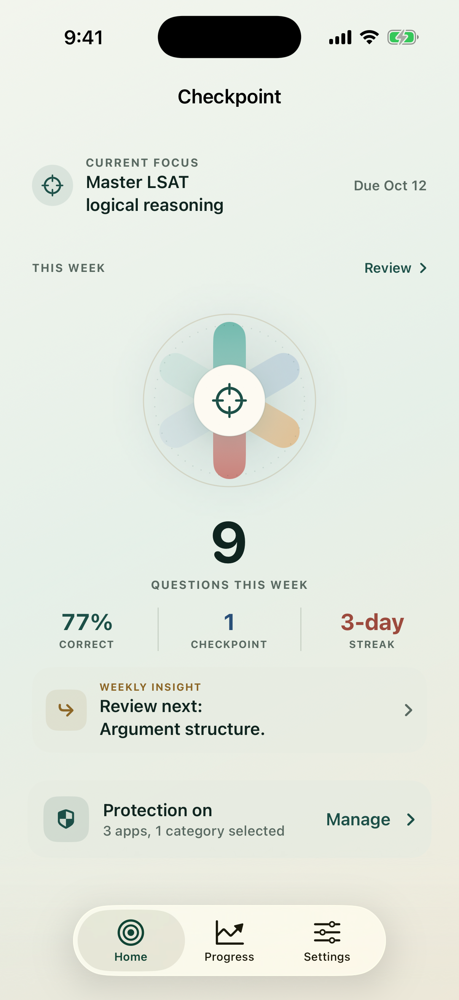

The production direction now preserves Study Beacon's recognizable center while translating it into Checkpoint's lighter, quieter visual system.

- Current Focus becomes a compact goal context row rather than a dominant card.
- The six-petal learning beacon is driven by real active-goal competencies; practiced skills receive stronger color while missing or unstarted slots stay pale.
- One dominant weekly fact is followed by accuracy, checkpoint clears, streak, and one prioritized learning insight.
- Healthy protection collapses to a single compact status/action row.
- Empty weeks use `Ready` instead of a large zero.
- Setup, error, and active-break states still promote protection controls above the insight card when action is needed.

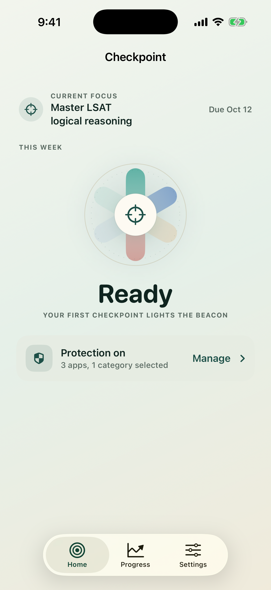

The lighter production version removes the prototype's hourly chart, most-used apps, yesterday duration, and protected-app reduction. Those require the separate Screen Time reporting path described below; removing the chart also keeps Protection visible on the first screen.

## 1. Impact ring — recommended base

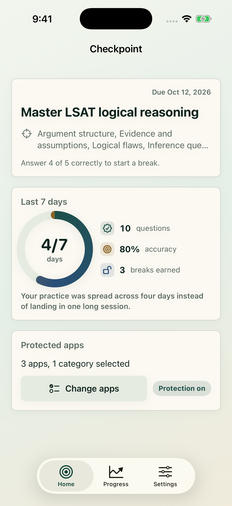

- Ring: distinct active days in the trailing seven days, giving it a real `x/7` denominator.
- Supporting metrics: questions answered, accuracy, and breaks earned.
- Best quality: clear hierarchy, fills the page without hiding protection controls, and scans quickly.
- Risk: accuracy is noisy with tiny samples. Hide it until at least five answers exist.

## 2. Insight deck

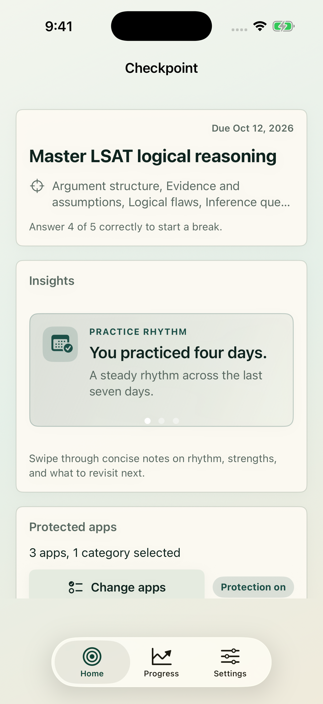

- Manual pages for practice rhythm, strongest skill, and next review area.
- Best quality: editorial and personal; content can evolve without redesigning the card.
- Risk: later cards are hidden. Do not auto-advance; support swipe, page dots, VoiceOver actions, and optionally previous/next buttons.

## 3. Focus exchange

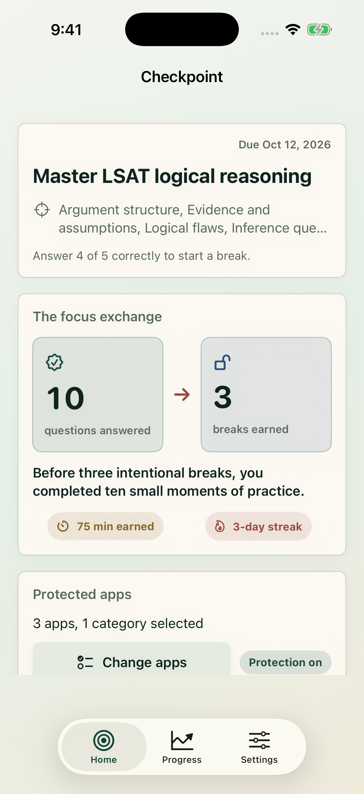

- Connects ten answered questions to three breaks earned, with granted break minutes and streak beneath.
- Best quality: communicates the product's value proposition most directly.
- Risk: it can make screen time feel like the reward. Keep the language focused on intentional breaks and learning moments.

## 4. Weekly momentum

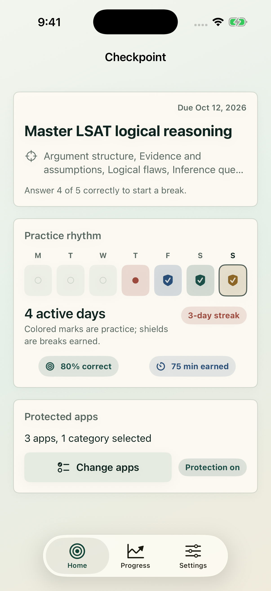

- Seven-day ledger: practice marks, checkpoint-clear shields, today outline, streak, accuracy, and break minutes.
- Best quality: the most colorful, distinctive, and habit-oriented concept.
- Risk: empty weeks can feel punitive. Use neutral outlines and gentle primer copy rather than a row of failures.

## 5. Protected-app time dial

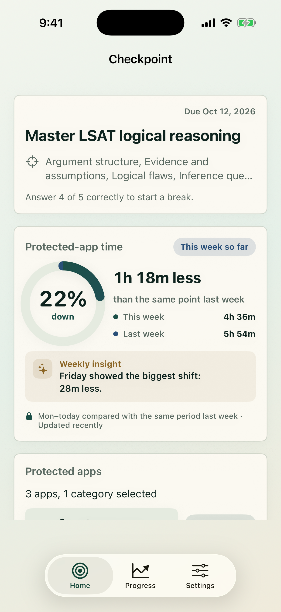

- Ring: a real percentage denominator—the reduction from the same elapsed portion of last week.
- Supporting values: exact protected-app totals for both comparison periods.
- Insight: one compact, potentially swipeable observation derived from the daily segments.
- Best quality: combines the colorful signature object and lightweight insight idea in one module.
- Risk: it is the tallest concept and pushes operational protection controls farther below the fold.

## 6. Protected-app time comparison bars

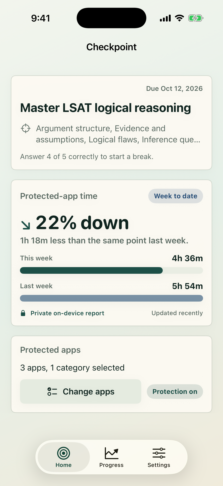

- Bars: this week's protected-app duration against the matching period last week.
- Best quality: the comparison reads immediately and handles flat or increased usage without distorting the visual.
- Risk: it is calmer and less distinctive than the dial.

## Modern hierarchy study

These concepts study the hierarchy in Opal's current public UI—not its gem, cave, palette, scoring system, or branded components. The useful principles are one dominant fact, one expressive zone, much quieter secondary information, progressive disclosure, and fewer bordered cards. References: [Opal's current product site](https://opalapp.com/), [App Store listing](https://apps.apple.com/us/app/opal-screen-time-control/id1497465230), and [official Home redesign write-up](https://opalapp.com/blog/introducing-the-new-opal-home-screen-track-your-screen-time-and-improve-your-focus).

## 7. Focus Halo

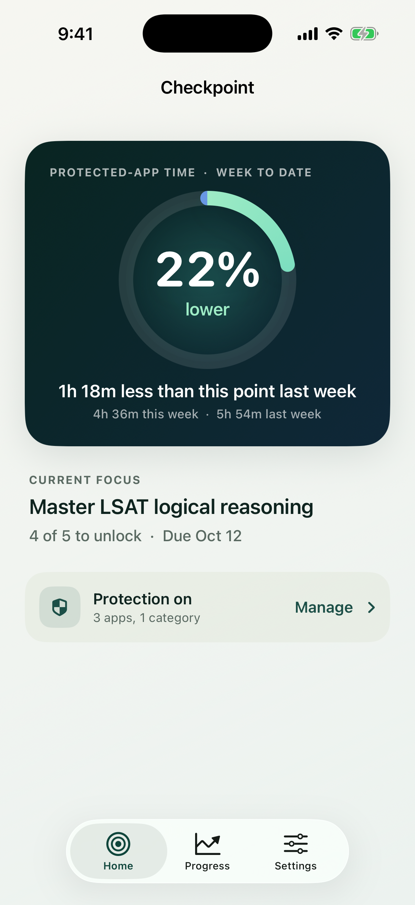

- One dark, high-contrast impact surface carries the entire weekly story.
- Current Focus becomes unframed editorial text; healthy protection collapses to a single status row.
- Best quality: strongest bridge from the existing Checkpoint palette to a more modern hierarchy.
- Risk: the hero is still a large card and therefore slightly less minimal than Quiet Signal.

## 8. Quiet Signal — recommended

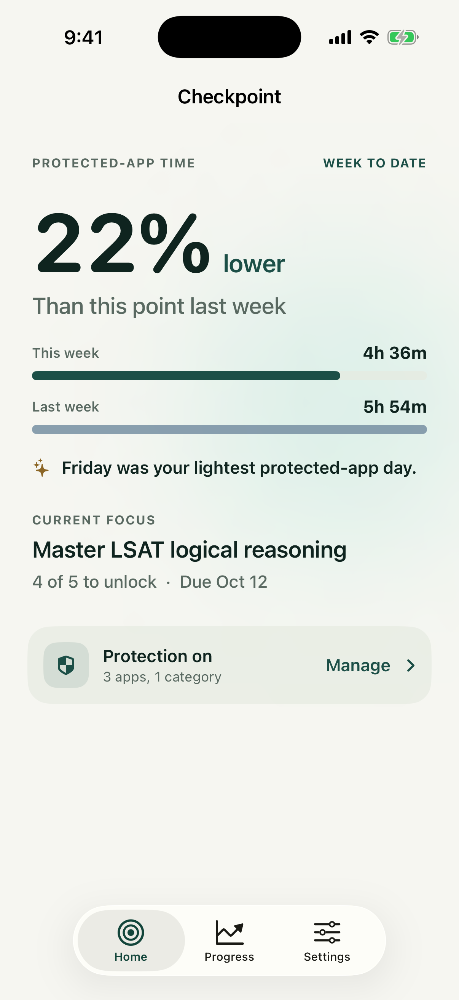

- The percentage becomes the visual anchor without a surrounding card or decorative object.
- Two eight-point comparison bars explain the number, and one short insight adds personality.
- Best quality: the cleanest, most ownable translation of the one-hero-fact principle.
- Risk: it relies heavily on excellent typography and spacing; weak data or long localization will be more visible.

## 9. Night Threshold

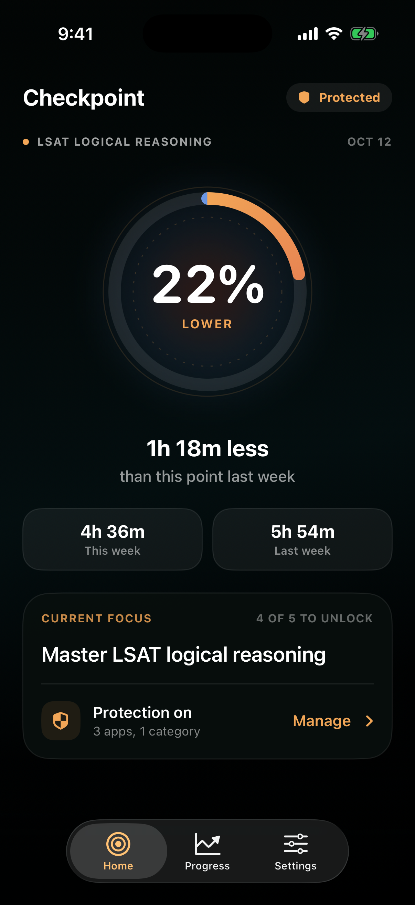

- An immersive dark canvas explores a checkpoint/target portal rather than an Opal-like collectible object.
- Goal and protection controls share one subordinate surface.
- Best quality: strongest emotional atmosphere and most dramatic hierarchy.
- Risk: it is a major brand shift and sits closest to the dark digital-wellbeing category aesthetic.

## 10. Study Beacon

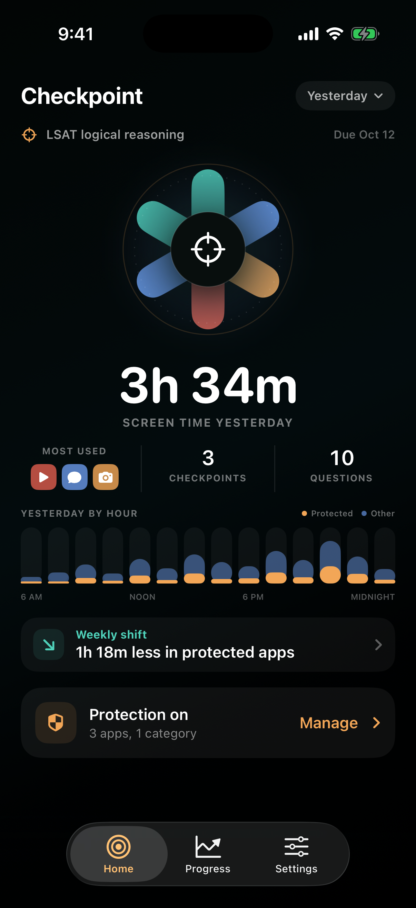

- A code-native six-skill learning rosette replaces the reference's gemstone and gives Checkpoint its own central object.
- The hero shows total Screen Time yesterday; surrounding signals combine most-used apps with Checkpoint clears and questions answered.
- The hourly chart separates protected-app activity from other screen time, followed by one weekly protected-app insight.
- The active goal stays visible at the top and the healthy Protection On action remains fully visible above the tab bar.
- Best quality: closest match to the user's desired information hierarchy while remaining visually distinct and Checkpoint-specific.
- Risk: it is data-rich. Every secondary label must remain quiet, and the chart should move to a detail screen if localization or larger text makes the first view feel crowded.

Production data split:

- Screen Time report: yesterday's duration, most-used applications, hourly activity, protected-app comparison, and freshness.
- Existing Checkpoint data: cleared checkpoints and questions answered.
- Do not infer Screen Time reduction from granted break minutes or claim that Checkpoint caused the difference.

## Recommended direction

Without Screen Time reporting, the implemented Light Study Beacon is the recommended direction. It keeps the reference-led signature object and compact insight while grounding every production metric in Checkpoint's existing learning data.

If Checkpoint adds Screen Time reporting, Quiet Signal remains the cleanest minimal direction. Study Beacon is the strongest reference-led direction when a signature visual, yesterday summary, app mix, and Checkpoint activity all need to coexist on Home. Focus Halo is the quieter middle ground; Night Threshold should remain an exploratory dark-mode direction. Any of them should replace/consolidate the existing Weekly Review card rather than stack another metrics section.

Suggested order:

1. Goal
2. Impact module
3. Protected apps
4. Optional next-step recommendation

When setup, permission, protection, or an active break needs attention, move Protected Apps above Impact so the operational action stays visible.

## Other promising ideas

- **Knowledge rosette:** a colorful radial Skill Map with one petal per skill, filled by estimated mastery. Strongest brand expression, highest implementation and accessibility cost.
- **Break dividend:** a paper-stamp row showing checkpoint clears and `75 break minutes earned`. Very direct, but should never say minutes were used or saved.
- **Turnaround wins:** “3 questions turned around after a miss,” derived from a later correct answer to the same question. Strong evidence of learning without claiming permanent mastery.

## Data and wording guardrails

Safe inputs already recorded by Checkpoint:

- attempt dates and results;
- unlock-event counts and granted minutes;
- checkpoint streak;
- current competency estimates;
- due/missed questions.

With today's data, avoid claims such as time saved, app usage reduced, urges resisted, blocked opens prevented, or productivity increased. Checkpoint deliberately does not read Screen Time activity history.

If the proposed Device Activity reporting path is added, observational wording such as “protected-app time is down” is supportable. Still avoid causal language such as “Checkpoint saved 1 hour” or “Checkpoint reduced your usage.” Compare week-to-date with the identical elapsed period last week, and hide the directional claim when data is incomplete or stale.

For an empty state, do not show a discouraging `0%` ring. Use a dotted ring with copy such as: “Your first checkpoint will start this view.”
